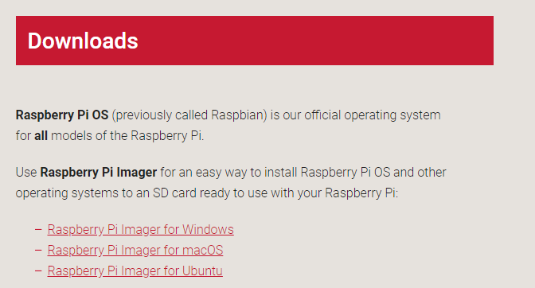
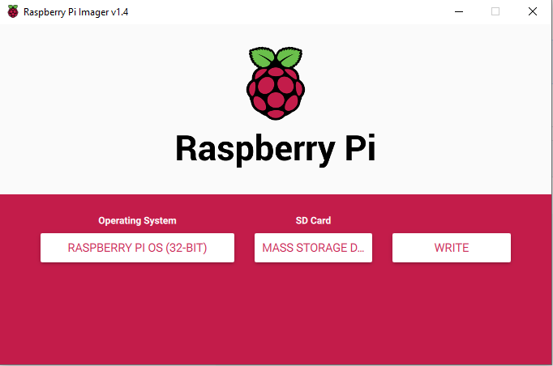

## قم بتثبيت نظام التشغيل Rasperry Pi OS على بطاقة SD الخاصة بك باستخدام Raspberry Pi Imager

يبيع العديد من البائعين بطاقات SD مع مثبت Rasperry Pi OS بسيط يسمى NOOBS مثبت مسبقًا ، ولكن يمكنك بسهولة تثبيت نظام Rasperry Pi OS بنفسك باستخدام جهاز كمبيوتر به منفذ بطاقة SD أو باستخدام قارئ بطاقة SD.

استخدام Raspberry Pi Imager أسهل طريقة لتثبيت Raspberry Pi OS على بطاقة SD الخاصة بك.

**ملاحظة:** يجب على المستخدمين الأكثر تقدماً الذين يتطلعون لتثبيت نظام تشغيل معين استخدام هذا الدليل إلى [تثبيت صور نظام التشغيل](https://www.raspberrypi.org/documentation/installation/installing-images/README.md).

### قم بتنزيل وتشغيل Raspberry Pi Imager

+ تفضل بزيارة صفحة [Raspberry Pi downloads](https://www.raspberrypi.org/downloads).
+ انقر على الرابط الخاص بـ Raspberry Pi Imager الذي يتوافق مع نظام التشغيل لديك.

+ عند انتهاء التحميل، انقر عليه لتشغيل المثبت.

### استخدام Raspberry Pi Imager

سيتم الكتابة فوق جميع البيانات المخزنة على بطاقة SD أثناء التهيئة وفقدانها نهائيًا ، لذا تأكد من عمل نسخة احتياطية من البطاقة أو أي ملفات تريد الاحتفاظ بها قبل تشغيل برنامج التثبيت.

عند تشغيل المثبت، قد يحاول نظام التشغيل الخاص بك منعك من تشغيله. على سبيل المثال ، في نظام Windows ، تلقيت الرسالة التالية:

+ إذا انبثق ذلك ، فانقر فوق `مزيد من المعلومات` ثم قم بتشغيل `على أي حال`.

+ قم بإدخال بطاقة الذاكرة SD في جهازك الكمبيوتر أو في بطاقة SD للكمبيوتر المحمول.

+ في Raspberry Pi Imager ، حدد نظام التشغيل الذي تريد تثبيته. الخيار الأول Rasperry Pi O هو نظام التشغيل الموصى به.

+ حدد بطاقة SD التي ترغب في تثبيتها عليها. المنصات المختلفة ستعرض المحركات بطرق مختلفة. سيُظهر لك نظام التشغيل Mac OS ، على سبيل المثال ، جميع محركات الأقراص بما في ذلك نظام التشغيل الرئيسي.

**ملاحظة:** تأكد من تحديد محرك الأقراص الصحيح. يمكن أن تكون سعة ذاكرة محركات الأقراص مؤشرًا مفيدًا لمحرك الأقراص الذي تختاره.

بمجرد تحديد نظام التشغيل وبطاقة SD ، سيظهر زر `WRITE`.

+ ثم ببساطة انقر فوق الزر `WRITE`.

+ انتظر حتى ينتهي Raspberry Pi Imager من التثبيت.

+ بمجرد الحصول على الرسالة التالية ، يمكنك إخراج بطاقة SD الخاصة بك.

