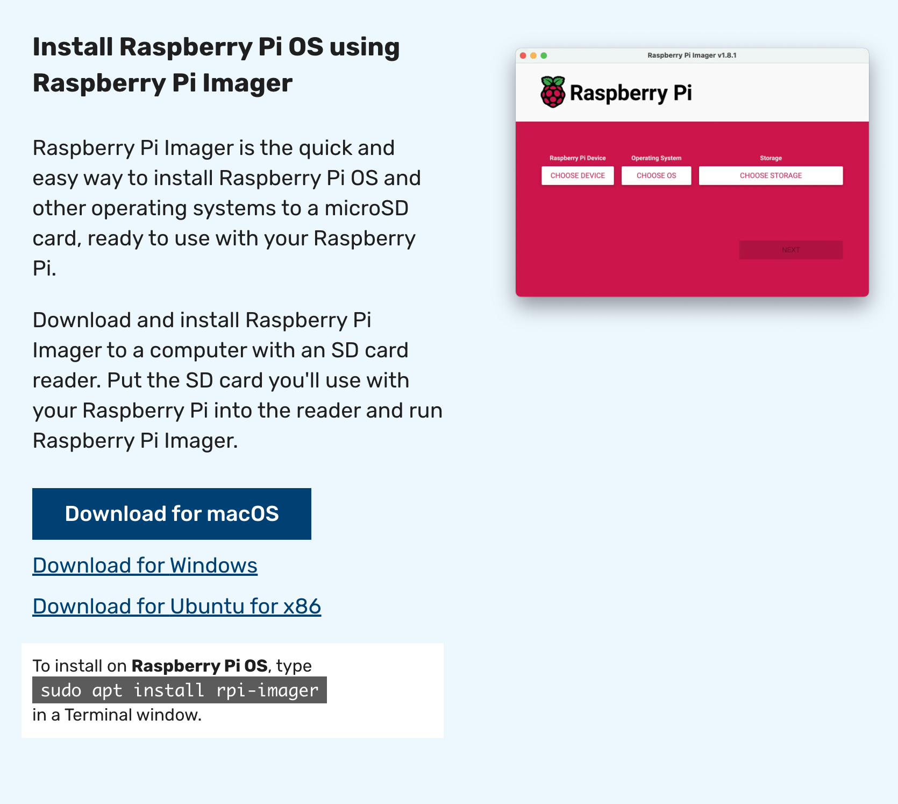

## Install Raspberry Pi OS on your SD card with the Raspberry Pi Imager

Using the **Raspberry Pi Imager** software is the easiest way to install Raspberry Pi OS on your SD card.

**Note:** More advanced users looking to install a particular operating system should use this guide to [installing operating system images](https://www.raspberrypi.org/documentation/installation/installing-images/README.md). 

### Download and launch the Raspberry Pi Imager

+ Visit the [Raspberry Pi downloads page](https://www.raspberrypi.org/downloads).
+ Click on the link for the Raspberry Pi Imager that matches your operating system.

+ When the download finishes, click on it to launch the installer.

When you launch the installer, your operating system may try to block you from running it. For example, Windows may give the following message: 

+ If you see this message, click on `More info` and then `Run anyway`.

### Write Raspberry Pi OS to a SD card

All data stored on the SD card will be overwritten during formatting and lost permanently, so make sure that you back up the card or any files you want to keep beforehand.

+ Insert the SD card into the computer or laptop’s SD card slot. Some laptops may not have their own SD card slots, but you can connect a USB adapter with an SD card slot. 

+ In the **Raspberry Pi Imager**, click "CHOOSE OS" and then select the option you want. If you are not sure, choose the first option - Raspberry Pi OS (64-bit). 

+ Click "CHOOSE STORAGE" and select the SD card you just inserted. 

**Note:** Make sure you are selecting the correct drive. The drive's memory capacity can be a useful indication of which drive you are selecting.

Once you have selected both the OS and the SD card, a new `WRITE` button will appear.

+ Click the `WRITE` button to begin writing to the SD card.

+ Wait for the Raspberry Pi Imager to finsh writing.

+ Once you get the following message, you can eject your SD card.

