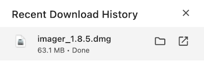
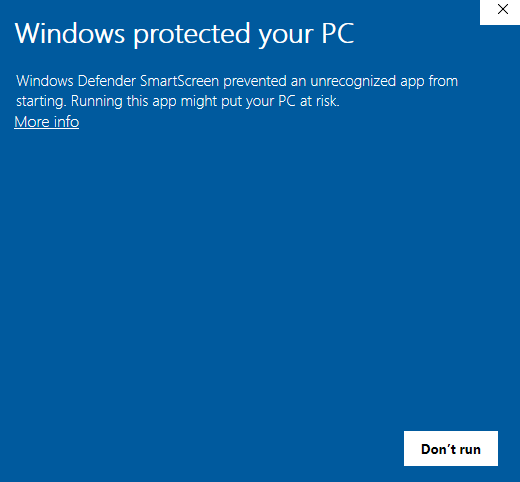
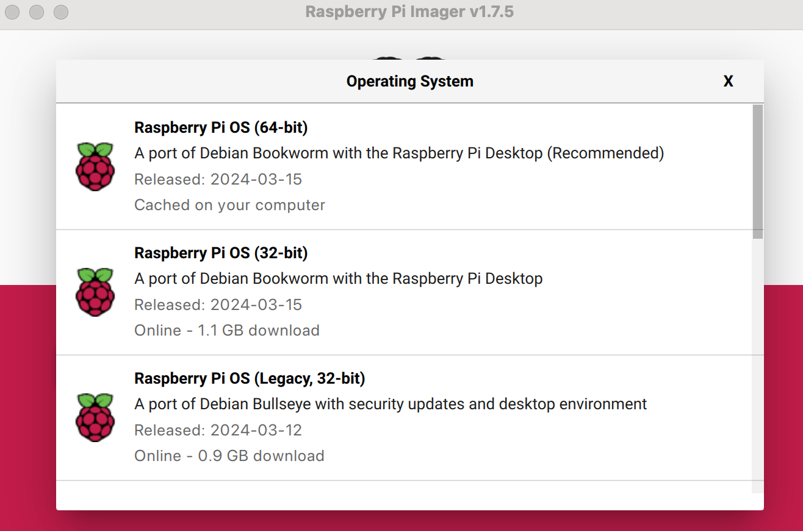
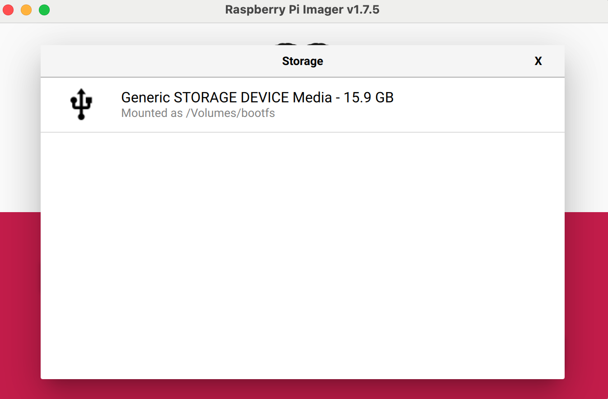
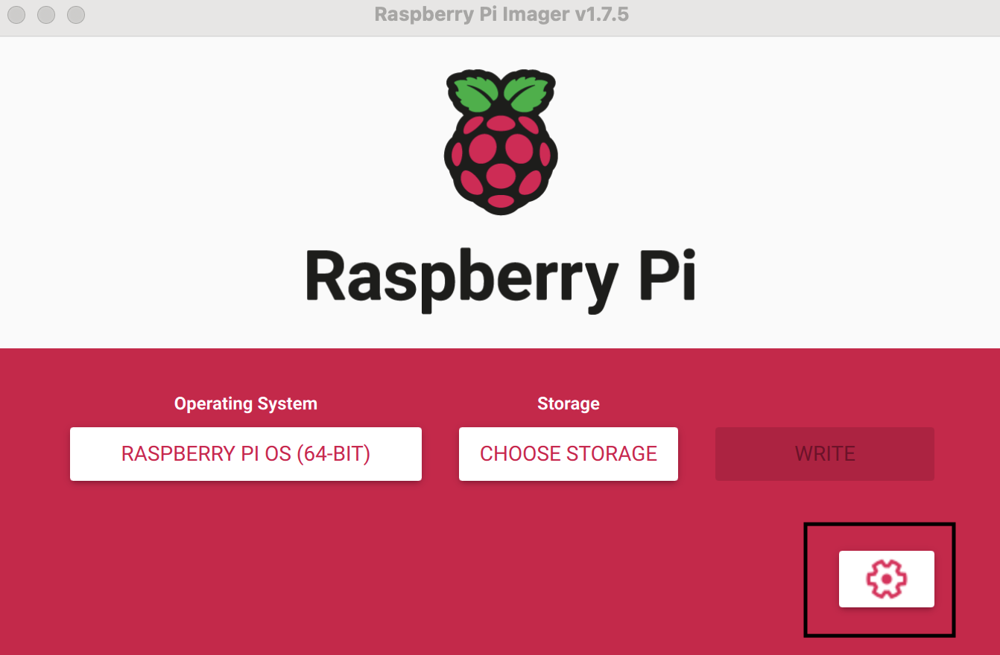
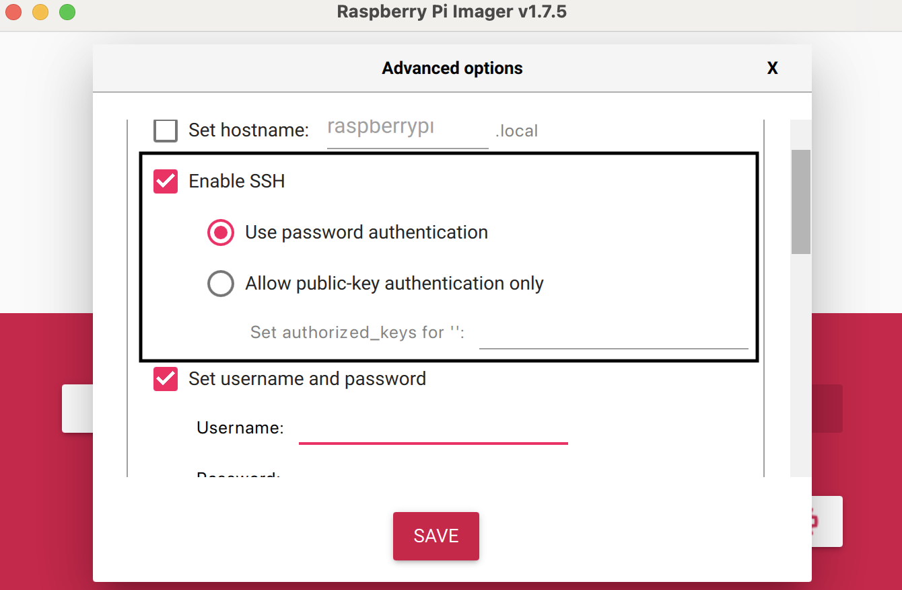
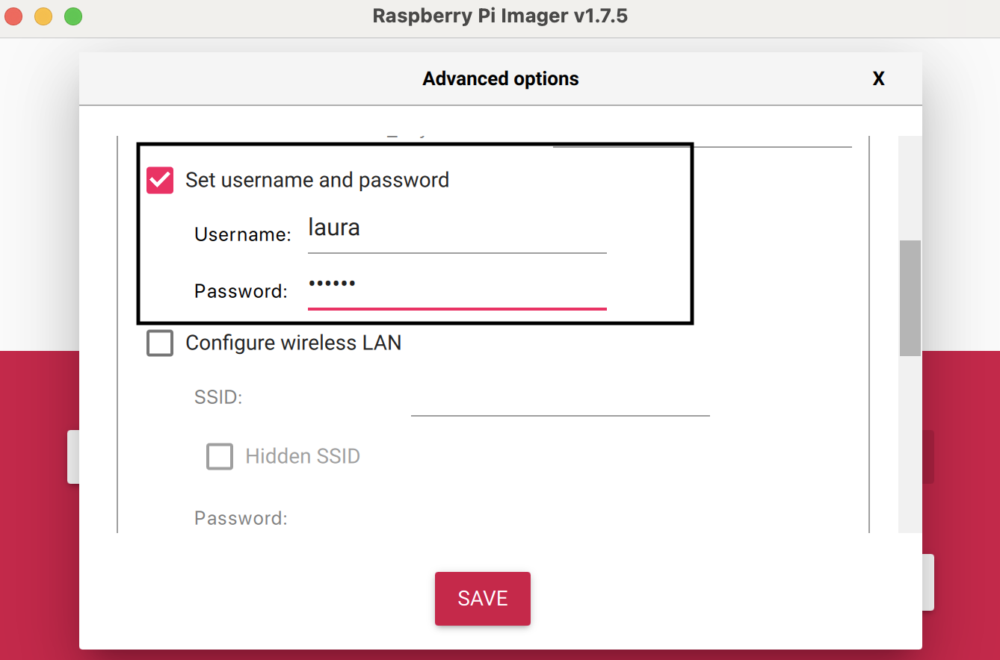
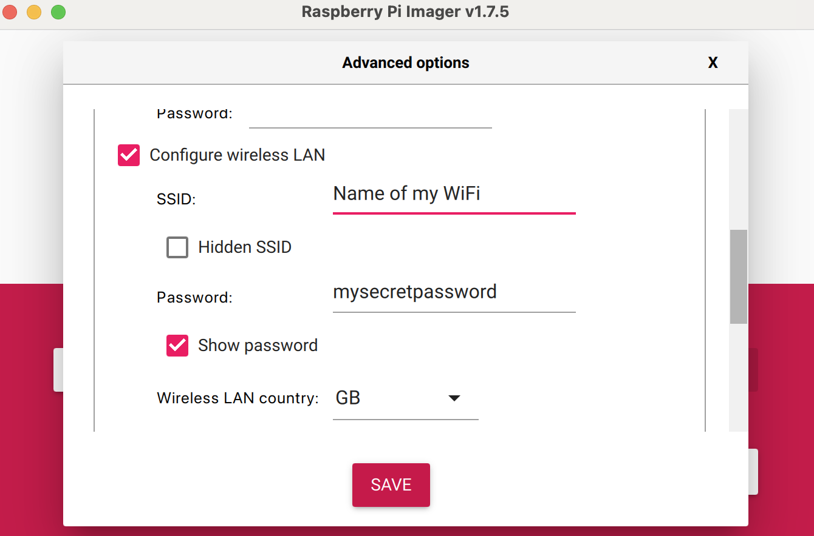
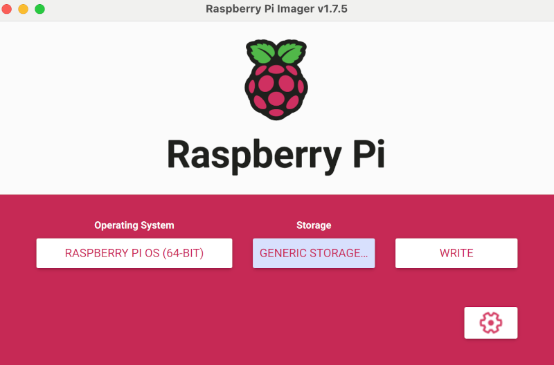

## Install Raspberry Pi OS with the Raspberry Pi Imager

Using the **Raspberry Pi Imager** software is the easiest way to install Raspberry Pi OS on your SD card.

### Download and launch the Raspberry Pi Imager

+ Visit the [Raspberry Pi downloads page](https://www.raspberrypi.org/downloads).
+ Click on the link for the Raspberry Pi Imager that matches your operating system.

+ When the download finishes, click on the downloaded file to launch the installer.

--- collapse ---
---
title: A warning message popped up
--- 
When you launch the installer, your operating system may try to block you from running it. For example, Windows may give the following message: 

+ If you see this message, click on `More info` and then `Run anyway`.

--- /collapse ---

### Write Raspberry Pi OS to a SD card

All data stored on the SD card will be overwritten during formatting and lost permanently, so make sure that you back up the card or any files you want to keep beforehand.

+ Insert the SD card into the computer or laptop’s SD card slot. Some laptops may not have a SD card slot, but you can connect a USB adapter which has an SD card slot. 

+ In the **Raspberry Pi Imager**, click "CHOOSE OS" and then select the option you want. If you are not sure, choose the first option - Raspberry Pi OS (64-bit). 

+ Click "CHOOSE STORAGE" and select the SD card you just inserted. 

Make sure you are selecting the correct drive. The drive's memory capacity can be a useful indication of which drive you are selecting.

--- collapse ---
---
title: I want to set up WiFi, SSH and my user account
---
You can set up the Raspberry Pi with the details of your WiFi network and enable SSH in advance via the imager, so that you can connect to your Raspberry Pi remotely. All of these settings are optional, and you can safely skip this section and set them up later if you are planning to connect your Raspberry Pi to a screen, keyboard and mouse.

+ Click on the cog icon to access the advanced settings menu.

+ To enable SSH, tick the box.

+ Tick 'set username and password' and fill in the boxes to set the username and password used to log on to your Raspberry Pi.

+ Tick 'Configure Wireless LAN' and enter the name of your wireless network and password. This will allow your Raspberry Pi to join the network and connect to the internet when it it switched on. 

--- /collapse ---

Once you have selected both the OS and the SD card, a new `WRITE` button will appear.

+ Click the `WRITE` button to begin writing to the SD card, then wait for the Raspberry Pi Imager to finish writing.

+ When you see a message saying that the write has finished, you can eject the SD card and use it in your Raspberry Pi.

**Note:** More advanced users looking to install a particular operating system should use this guide to [installing operating system images](https://www.raspberrypi.org/documentation/installation/installing-images/README.md). 