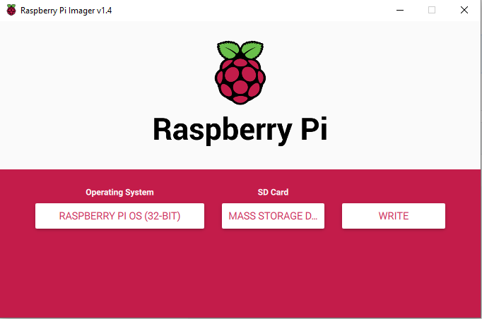

## Set up your SD card

If you have an SD card that doesn't have the Raspbian operating system on it yet, or if you want to reset your Raspberry Pi, you can easily install Raspbian yourself. To do so, you need a computer that has an SD card port — most laptop and desktop computers have one.

### The Raspbian operating system via the Raspberry Pi Imager

Using the Raspberry Pi Imager is the easiest way to install Raspbian on your SD card.

**Note:** more advanced users looking to install a particular operating system should use this guide to [installing operating system images](https://www.raspberrypi.org/documentation/installation/installing-images/README.md). 

#### Download and launch the Raspberry Pi Imager

+ Visit the [Raspberry Pi downloads page](https://www.raspberrypi.org/downloads).
+ Click on the link for the Raspberry Pi Imager that matches your operating system.

+ When the download finishes, click it to launch the installer.

#### Using the Raspberry Pi Imager

Anything that's stored on the SD card will be overwritten during formatting. So if the SD card on which you want to install Raspbian currently has any files on it, e.g. from an older version of Raspbian, you may wish to back these files up first to not lose them permanently.

When you launch the installer, your operating system may try to block you from running it. For example on Windows I get the following: 

+ If you get this, click on `More info` and then `Run anyway`.

+ Follow the instructions to install and run the Raspberry Pi Imager.

+ Insert your SD card into the computer or laptop’s SD card slot.

+ In the Raspberry Pi Imager, select the OS that you want to install and the SD card you would like to install it on.

+ Then simply click the `WRITE` button.

+ Wait for the Raspberry Pi Imager to finsh writing.

+ Once you get the following message, you can eject your SD card.

