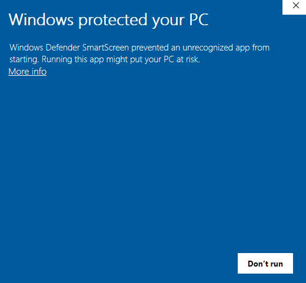
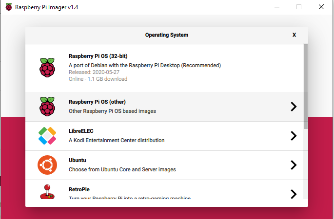

## Install Rasperry Pi OS on your SD card with the Raspberry Pi Imager

Many vendors sell SD cards with a simple Rasperry Pi OS installer called NOOBS preinstalled but you can really easily install Rasperry Pi OS yourself using a computer that has an SD card port or using an SD card reader.

Using the Raspberry Pi Imager is the easiest way to install Rasperry Pi OS on your SD card.

**Nota:** Los usuarios más avanzados que deseen instalar un sistema operativo en particular deben usar esta guía para [instalar imágenes del sistema operativo](https://www.raspberrypi.org/documentation/installation/installing-images/README.md).

### Descarga y ejecuta el Raspberry Pi Imager

+ Visita la [página de descargas de Raspberry Pi](https://www.raspberrypi.org/downloads).
+ Haz clic en el enlace de Raspberry Pi Imager que coincida con tu sistema operativo.

+ Cuando finalice la descarga, haz clic en ella para iniciar el instalador.

### Usando el Raspberry Pi Imager

Todos los datos almacenados en la tarjeta SD se sobrescribirán durante el formateo y se perderán permanentemente, así que asegúrate de hacer una copia de seguridad de la tarjeta o de los archivos que desees conservar antes de ejecutar el instalador.

Cuando inicias el instalador, tu sistema operativo puede intentar bloquear su ejecución. Por ejemplo, Windows puede dar el siguiente mensaje:

+ Si obtienes esto, haz clic en `Más información` y luego `Ejecutar de todos modos`.

+ Inserta tu tarjeta SD en la ranura para tarjetas SD del ordenador o del portátil.

+ En el Raspberry Pi Imager, selecciona el sistema operativo que deseas instalar. The first option, Rasperry Pi O, is the recommended OS.

+ Selecciona la tarjeta SD en la que deseas instalarlo. Las diferentes plataformas mostrarán las unidades de diferentes maneras. El sistema operativo Mac, por ejemplo, te mostrará todas las unidades, incluido el sistema operativo principal.

**Nota:** Asegúrate de seleccionar la unidad correcta. La capacidad de memoria de las unidades puede ser una indicación útil para saber qué unidad estás seleccionando.

Una vez que hayas seleccionado tanto el sistema operativo como la tarjeta SD, aparecerá un nuevo botón `WRITE` (Nota: escribir).

+ Luego simplemente haz clic en el botón `ESCRIBIR`.

+ Espera a que Raspberry Pi Imager termine de escribir.

+ Una vez que recibas el siguiente mensaje, puedes expulsar tu tarjeta SD.

