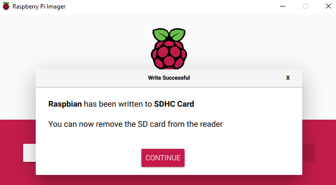

## Raspberry Pi Imager की मदद से अपने एसडी कार्ड पर Raspberry Pi OS स्थापित करें

कई विक्रेता ऐसे एसडी कार्ड बेचते हैं जिनमें पहले से एक साधारण Raspberry Pi OS इंस्टॉलर स्थापित होता है, जिन्हें एनओओबीएस कहा जाता है, लेकिन आप Raspberry Pi OS को आसानी से एक ऐसे कंप्यूटर का उपयोग कर अपने आप स्थापित कर सकते हैं जिसमें एसडी कार्ड पोर्ट या एसडी कार्ड रीडर हो।

Raspberry Pi Imager का उपयोग करना आपके एसडी कार्ड पर रास्पबियन स्थापित करने का सबसे आसान तरीका है।

**ध्यान दें:** किसी विशेष ऑपरेटिंग सिस्टम को स्थापित करने के लिए देख रहे अधिक उन्नत उपयोगकर्ताओं को इस गाइड [installing operating system images](https://www.raspberrypi.org/documentation/installation/installing-images/README.md) का उपयोग करना चाहिए I

### Raspberry Pi Imager को डाउनलोड करें और लॉन्च करें

+ [Raspberry Pi डाउनलोड पेज](https://www.raspberrypi.org/downloads) पर जाएं।
+ आपके ऑपरेटिंग सिस्टम से मेल खाने वाले Raspberry Pi Imager के लिंक पर क्लिक करें।

+ जब डाउनलोड पूरा हो जाए, तो इंस्टॉलर को लॉन्च करने के लिए इसे क्लिक करें।

### Raspberry Pi Imager का उपयोग करना

एसडी कार्ड पर संग्रहीत सभी डेटा को स्वरूपण के दौरान अधिलेखित कर दिया जाएगा और स्थायी रूप से खो जाएगा, इसलिए सुनिश्चित करें कि आप इंस्टॉलर को चलाने से पहले कार्ड या किसी भी फाइल का बैकअप लें।

जब आप इंस्टॉलर लॉन्च करते हैं, तो आपका ऑपरेटिंग सिस्टम आपको इसे चलाने से रोकने की कोशिश कर सकता है। उदाहरण के लिए, Windows पर निम्नलिखित संदेश प्राप्त हो सकता है:

+ यदि यह पॉप अप हो जाता है, तो `More info` और फिर `Run anyway` क्लिक करें।

+ अपने एसडी कार्ड को कंप्यूटर या लैपटॉप के एसडी कार्ड स्लॉट में डालें।

+ Raspberry Pi Imager में, उस ओएस का चयन करें जिसे आप इंस्टॉल करना चाहते हैं। पहला विकल्प, Raspberry Pi O, अनुशंसित ओएस है।

+ उस एसडी कार्ड का चयन करें जिसमें आप इसे स्थापित करना चाहते हैं। विभिन्न प्लेटफ़ॉर्म विभिन्न तरीकों से ड्राइव प्रदर्शित करेंगे। उदाहरण के लिए, Mac OS, आपको मुख्य ऑपरेटिंग सिसाइटम सहित सभी ड्राइव दिखाएगा।

**नोट:** सुनिश्चित करें कि आप सही ड्राइव का चयन कर रहे हैं। ड्राइव मेमोरी क्षमता एक उपयोगी संकेत हो सकती है कि आप किस ड्राइव का चयन कर रहे हैं।

एक बार जब आप ओएस और एसडी कार्ड दोनों का चयन कर लेते हैं, तो एक नया `WRITE` बटन दिखाई देगा।

+ फिर बस `WRITE` बटन पर क्लिक करें।

+ लेखन समाप्त करने के लिए Raspberry Pi Imager की प्रतीक्षा करें।

+ एक बार जब आपको निम्न संदेश मिल जाता है, तो आप अपने एसडी कार्ड को निकाल सकते हैं।

