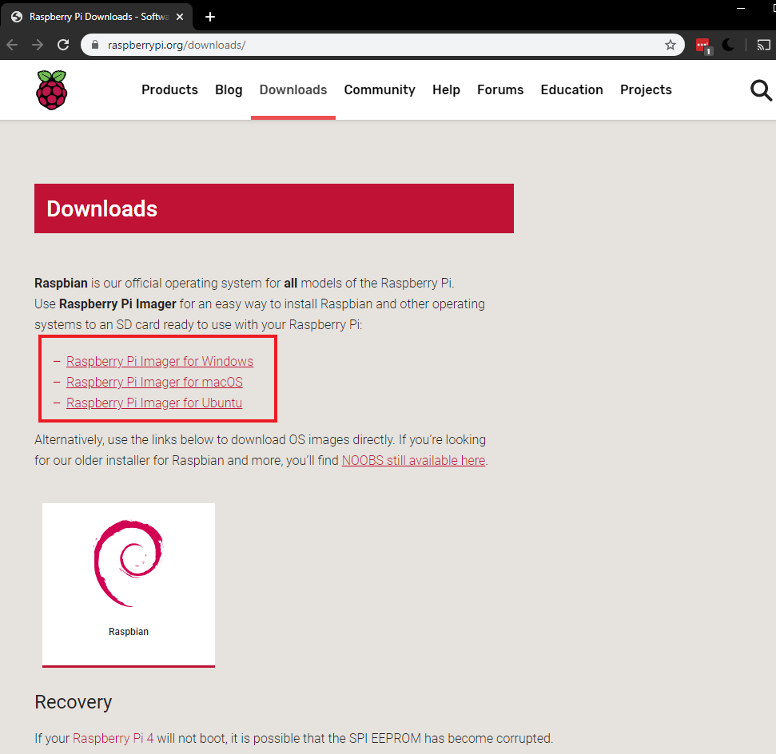
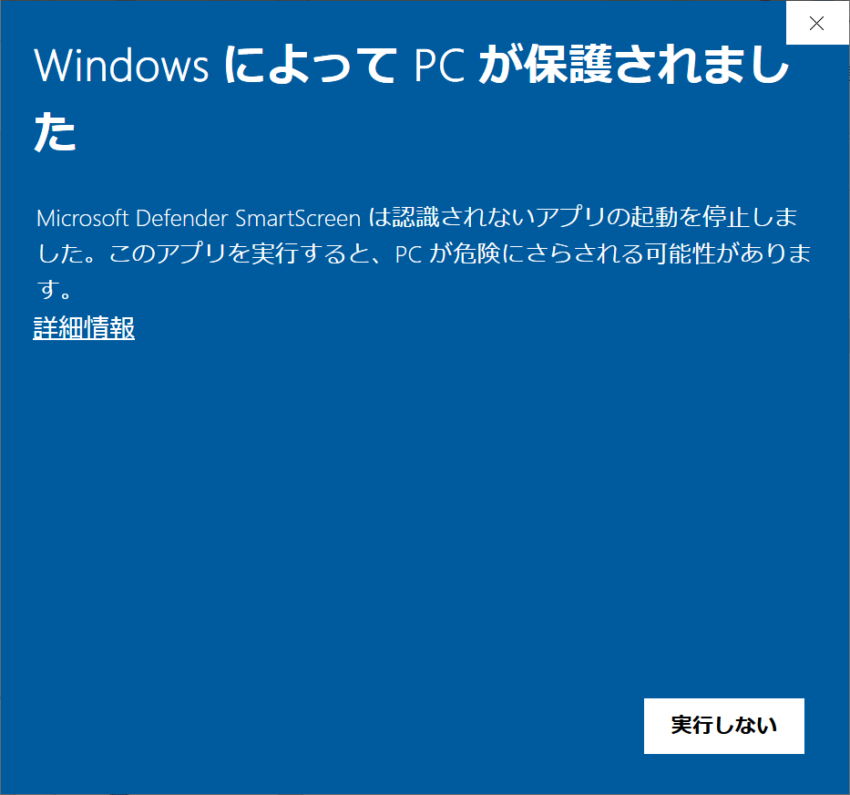
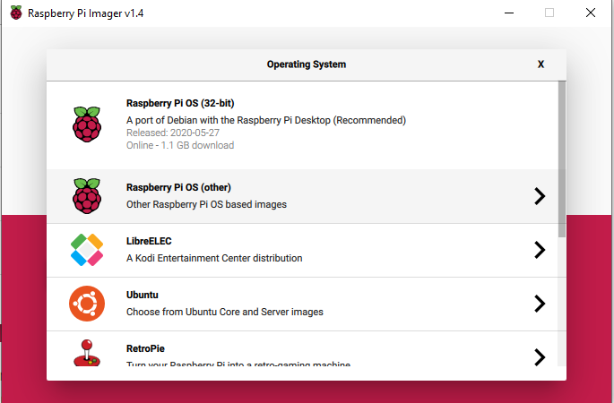

## Raspberry Pi Imagerを使ってSDカードにRaspberry Pi OSをインストールする

Many vendors sell SD cards with a simple Rasperry Pi OS installer called NOOBS preinstalled but you can really easily install Rasperry Pi OS yourself using a computer that has an SD card port or using an SD card reader.

Using the Raspberry Pi Imager is the easiest way to install Rasperry Pi OS on your SD card.

**注意:**特定のオペレーティング・システムのインストールを検討している上級ユーザーは、このガイドを使用して[オペレーティング・システム・イメージのインストール](https://www.raspberrypi.org/documentation/installation/installing-images/README.md)を行ってください.

### Raspberry Pi Imagerをダウンロードして起動する

+ [Raspberry Piのダウンロードページ](https://www.raspberrypi.org/downloads)にアクセスする。
+ 使用しているオペレーティングシステムに対応するRaspberry Pi Imagerのリンクをクリックします。

+ ダウンロードが完了したら、クリックしてインストーラを起動します。

### Raspberry Pi Imagerを使う

SDカードに保存されているすべてのデータは、フォーマット中に上書きされて永久に失われるので、インストーラを実行する前にSDカードや保存しておきたいファイルを必ずバックアップしてください。

インストーラを起動したときに、使用しているオペレーティングシステムがインストーラの実行を阻止しようとすることがあります。 例えば、Windowsでは次のメッセージが表示されることがあります。

+ これが表示されたら、`詳細情報`をクリックして、`それでも実行する`をクリックします。

+ コンピュータやノートパソコンのSDカードスロットにSDカードを入れます。

+ Raspberry Pi Imagerでインストールしたいオペレーティングシステムを選びます。 最初の選択にあるRaspberry Pi OSがおすすめです。

+ インストールしたいSDカードを選びます。 ドライブの表示はプラットフォームごとに違います。 例えば、macOSではオペレーティングシステムが入っているドライブも含め、すべてのドライブが表示されます。

**注意:** 正しいドライブを選んでいるか確認してください。 ドライブの容量を見れば、どのドライブを選んでいるかわかります。

オペレーティングシステムとSDカードの両方を選ぶと、新たに`WRITE`ボタンが表示されます。

+ `WRITE`ボタンをクリックします。

+ Raspberry Pi Imagerの書き込みが終わるのを待ちます。

+ 次のメッセージが表示されたら、SDカードを取り出します。

