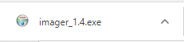
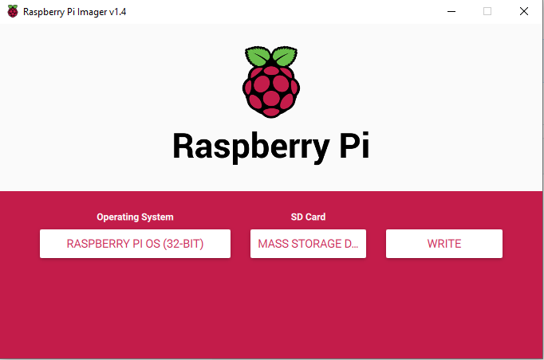

## Raspberry Pi Imager ನೊಂದಿಗೆ ನಿಮ್ಮ SD card ‌ನಲ್ಲಿ Raspberry Pi OS ಅನ್ನು Install ಮಾಡಿ

ಅನೇಕ ಮಾರಾಟಗಾರರು SD card‌ಗಳಲ್ಲಿ NOOBS ಮೊದಲೇ install ಆಗಿರುವ ಸರಳ Raspberry Pi OS Installer ನೊಂದಿಗೇ ಮಾರಾಟ ಮಾಡುತ್ತಾರೆ ಆದರೆ SD card ಪೋರ್ಟ್ ಹೊಂದಿರುವ ಕಂಪ್ಯೂಟರ್ ಬಳಸಿ ಅಥವಾ SDcard ರೀಡರ್ ಬಳಸಿ ನೀವು ಸಹ Raspberry Pi OS ಅನ್ನು Install ಮಾಡಬಹುದು.

ನಿಮ್ಮ SD ಕಾರ್ಡ್‌ನಲ್ಲಿ Raspberry Pi OS ಅನ್ನು Install ಮಾಡಲು Raspberry Pi Imager ಅನ್ನು ಬಳಸುವುದು ಸುಲಭವಾದ ಮಾರ್ಗವಾಗಿದೆ.

** ಗಮನಿಸಿ: ** ನಿರ್ದಿಷ್ಟ ಆಪರೇಟಿಂಗ್ ಸಿಸ್ಟಮ್ ಅನ್ನು Install ಮಾಡಲು ಬಯಸುವ ಹೆಚ್ಚು ಸುಧಾರಿತ ಬಳಕೆದಾರರು [ ಆಪರೇಟಿಂಗ್ ಸಿಸ್ಟಮ್ ಇಮೇಜ್ ಅನುಸ್ಥಾಪನೇ](https://www.raspberrypi.org/documentation/installation/installing-images/README.md) ಅನ್ನು ಬಳಸಬೇಕು.

### Raspberry Pi Imager ಅನ್ನು ಡೌನ್ಲೋಡ್ ಮಾಡಿ ಮತ್ತು ಪ್ರಾರಂಭಿಸಿ

+ [Raspberry Pi ಡೌನ್‌ಲೋಡ್ ಪುಟ](https://www.raspberrypi.org/downloads)ಕ್ಕೆ ಭೇಟಿ ನೀಡಿ.
+ ನಿಮ್ಮ ಆಪರೇಟಿಂಗ್ ಸಿಸ್ಟಮ್‌ಗೆ ಹೊಂದಿಕೆಯಾಗುವ Raspberry Pi Imagerಗಾಗಿ ಲಿಂಕ್ ಅನ್ನು ಕ್ಲಿಕ್ ಮಾಡಿ.

+ ಡೌನ್‌ಲೋಡ್ ಮುಗಿದ ನಂತರ, Installer ಅನ್ನು ಪ್ರಾರಂಭಿಸಲು ಅದರ ಮೇಲೆ ಕ್ಲಿಕ್ ಮಾಡಿ.

### Raspberry Pi Imager ಬಳಸುವುದು

SD card‌ನಲ್ಲಿ ಸಂಗ್ರಹವಾಗಿರುವ ಎಲ್ಲಾ ಡೇಟಾವನ್ನು ಫಾರ್ಮ್ಯಾಟಿಂಗ್ ಸಮಯದಲ್ಲಿ ತಿದ್ದಿ ಬರೆಯಲಾಗುತ್ತದೆ ಮತ್ತು ಶಾಶ್ವತವಾಗಿ ಕಳೆದುಹೋಗುತ್ತದೆ, ಆದ್ದರಿಂದ ನೀವು card ಅಥವಾ Installation ಚಾಲನೆ ಮಾಡುವ ಮೊದಲು ಇರಿಸಿಕೊಳ್ಳಲು ಬಯಸುವ ಯಾವುದೇ ಫೈಲ್‌ಗಳನ್ನು ಬ್ಯಾಕಪ್ ಮಾಡುತ್ತಿದ್ದೀರಿ ಎಂದು ಖಚಿತಪಡಿಸಿಕೊಳ್ಳಿ.

ನೀವು Installer ಅನ್ನು ಪ್ರಾರಂಭಿಸಿದಾಗ, ನಿಮ್ಮ ಆಪರೇಟಿಂಗ್ ಸಿಸ್ಟಮ್ ಅದನ್ನು ಶುರುವಾಗುವುದನ್ನು ತಡೆಯಲು ಪ್ರಯತ್ನಿಸಬಹುದು. ಉದಾಹರಣೆಗೆ, Windows ಈ ಕೆಳಗಿನ ಸಂದೇಶವನ್ನು ನೀಡಬಹುದು:

+ ಈ ರೀತಿಯ ಬಂದರೆ, ` More info` ಮೇಲೆ ಕ್ಲಿಕ್ ಮಾಡಿ ನಂತರ `Run anyway` ಕ್ಲಿಕ್ ಮಾಡಿ.

+ ನಿಮ್ಮ SD card ಅನ್ನು ಕಂಪ್ಯೂಟರ್ ಅಥವಾ ಲ್ಯಾಪ್‌ಟಾಪ್ SD card ಸ್ಲಾಟ್‌ಗೆ ಸೇರಿಸಿ.

+ Raspberry Pi Imager ನಲ್ಲಿ, ನೀವು Install ಮಾಡಲು ಬಯಸುವ OS ಅನ್ನು ಆಯ್ಕೆ ಮಾಡಿ. ಮೊದಲ ಆಯ್ಕೆ, Raspberry Pi OS, ಶಿಫಾರಸು ಮಾಡಲಾದ OS ಆಗಿದೆ.

+ ನೀವು Install ಮಾಡಲು ಬಯಸುವ SD Card ಅನ್ನು ಆಯ್ಕೆಮಾಡಿ. ವಿಭಿನ್ನ ಪ್ಲಾಟ್‌ಫಾರ್ಮ್‌ಗಳು ಡ್ರೈವ್‌ಗಳನ್ನು ವಿಭಿನ್ನ ರೀತಿಯಲ್ಲಿ ಪ್ರದರ್ಶಿಸುತ್ತವೆ. Mac OS, ಉದಾಹರಣೆಗೆ, ನೀವು ಮುಖ್ಯ ಆಪರೇಟಿಂಗ್ ಸಿಸ್ಟಂ ಸೇರಿದಂತೆ ಎಲ್ಲಾ ಡ್ರೈವ್‌ಗಳನ್ನು ನಿಮಗೆ ತೋರಿಸುತ್ತದೆ.

**ಗಮನಿಸಿ:** ನೀವು ಸರಿಯಾದ ಡ್ರೈವ್ ಅನ್ನು ಆಯ್ಕೆ ಮಾಡುತ್ತಿದ್ದೀರಿ ಎಂದು ಖಚಿತಪಡಿಸಿಕೊಳ್ಳಿ. ಡ್ರೈವ್‌ಗಳ ಮೆಮೊರಿ ಸಾಮರ್ಥ್ಯವು ನೀವು ಯಾವ ಡ್ರೈವ್ ಅನ್ನು ಆಯ್ಕೆ ಮಾಡುತ್ತಿದ್ದೀರಿ ಎಂಬುದರ ಉಪಯುಕ್ತ ಸೂಚನೆಯಾಗಿರಬಹುದು.

OS ಮತ್ತು SD card ಎರಡನ್ನೂ ನೀವು ಆರಿಸಿದ ನಂತರ, ಹೊಸ `WRITE` ಬಟನ್ ಕಾಣಿಸುತ್ತದೆ.

+ ನಂತರ `WRITE` ಬಟನ್ ಕ್ಲಿಕ್ ಮಾಡಿ.

+ Raspberry Pi Imager ಬರೆಯುವುದು ಮುಗಿಯಲು ಕಾಯಿರಿ.

+ ಒಮ್ಮೆ ನೀವು ಈ ಕೆಳಗಿನ ಸಂದೇಶವನ್ನು ಪಡೆದರೆ, ನಿಮ್ಮ SD card ಅನ್ನು ನೀವು ಹೊರತೆಗೆಯಬಹುದು.

