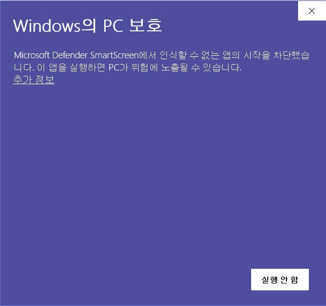
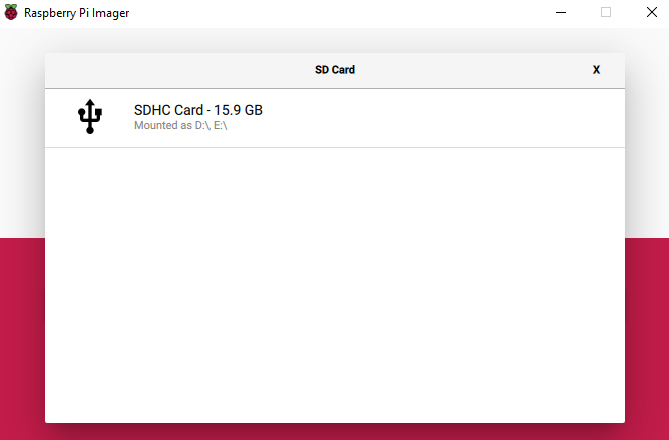

## Install Rasperry Pi OS on your SD card with the Raspberry Pi Imager

Many vendors sell SD cards with a simple Rasperry Pi OS installer called NOOBS preinstalled but you can really easily install Rasperry Pi OS yourself using a computer that has an SD card port or using an SD card reader.

Using the Raspberry Pi Imager is the easiest way to install Rasperry Pi OS on your SD card.

**참고:**특정 운영 체제를 설치하려는 고급 사용자는 [운영체제 이미지 설치](https://www.raspberrypi.org/documentation/installation/installing-images/README.md) 가이드를 사용하세요.

### Raspberry Pi Imager 다운로드 및 설치

+ [Raspberry Pi 다운로드 페이지](https://www.raspberrypi.org/downloads)를 방문하세요.
+ 자신의 운영 체제에 맞게 Rasberry Pi Imager 링크를 클릭합니다.

+ 다운로드가 끝나면 클릭하여 설치 프로그램을 실행하세요.

### Raspberry Pi Imager 사용하기

SD 카드에 저장된 모든 데이터는 포맷을 하면 덮어써지고 영구적으로 삭제되므로 설치 프로그램을 실행하기 전에 카드나 저장할 파일을 백업해야 합니다.

설치 프로그램을 실행하면, 당신의 운영체제가 프로그램 실행을 차단할 것입니다. 예를 들어, Windows 에서는 다음과 같은 메시지가 나옵니다:

+ 이렇게 된다면 `추가 정보`를 클릭한 후, `실행`을 클릭하세요.

+ SD 카드를 컴퓨터 또는 노트북의 SD 카드 슬롯에 삽입하세요.

+ Raspberry Pi Imager에서 설치하려는 운영체제를 선택하세요. The first option, Rasperry Pi O, is the recommended OS.

+ 운영체제를 설치하려는 SD 카드를 선택하세요. 설치 환경마다 다른 방식으로 드라이브가 표시됩니다. 예를 들어 Mac OS에서는 당신의 주 운영 체제를 포함한 모든 드라이브를 보여줄 것입니다.

**참고:** 올바른 드라이브를 선택했는지 확인하세요. 드라이브 용량을 보면 당신이 선택한 드라이브가 어느 것인지 손쉽게 파악할 수 있습니다.

운영체제와 SD 카드를 선택하면 새로운 `WRITE` 버튼이 나타날 것입니다.

+ 그런 다음 `WRITE` 버튼을 클릭하세요.

+ Raspberry Pi Imager가 쓰기를 마칠 때까지 기다리세요.

+ 다음의 메시지가 나온다면 SD 카드를 빼도 됩니다.

