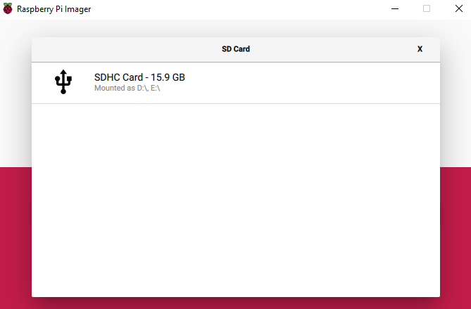

## Raspberry Pi Imager चा वापर करून SD कार्ड वर Raspberry Pi OS इन्स्टॉल करणे

बरेच विक्रेते NOOBS नावाच्या एका साध्या Raspberry Pi OS इन्स्टॉलरसह SD Cardची विक्री करतात परंतु आपण SD card पोर्ट असलेल्या संगणकाचा वापर करून किंवा SD card रीडर वापरुन Raspberry Pi OS खरोखर सहज इन्स्टॉल करू शकता.

आपल्या एसडी कार्डवर Raspberry Pi इमेजर वापरणे हा Raspberry Pi OS इन्स्टॉल करण्याचा सर्वात सोपा मार्ग आहे.

**नोंद:** एखादं विशिष्ट ऑपरेटिंग सिस्टम इन्स्टॉल करण्यासाठी शोधत असलेल्या अधिक प्रगत वापरकर्त्यांनी [ऑपरेटिंग सिस्टम image इन्स्टॉल करण्यासाठी](https://www.raspberrypi.org/documentation/installation/installing-images/README.md) हे मार्गदर्शक वापरावे.

### Raspberry Pi इमेजर डाउनलोड आणि सुरु करा

+ [Raspberry Pi डाउनलोड पेज](https://www.raspberrypi.org/downloads) ला भेट द्या.
+ आपल्या ऑपरेटिंग सिस्टमशी जुळणार्‍या Raspberry Pi इमेजरच्या लिंक वर क्लिक करा.

+ डाउनलोड पूर्ण झाल्यावर इंस्टॉलर लाँच करण्यासाठी त्यावर क्लिक करा.

### Raspberry Pi इमेजर वापरणे

एसडी कार्डवर संचयित केलेला सर्व डेटा स्वरूपण दरम्यान अधिलिखित केला जाईल आणि कायमचा गमावला जाईल, म्हणून आपण हे स्थापित करा की आपण कार्ड किंवा कोणत्याही फायलींचा बॅकअप घेतला आहे याची खात्री करा.

जेव्हा आपण इंस्टॉलर सुरु करता तेव्हा आपली ऑपरेटिंग सिस्टम आपल्याला ते running पासून block करण्याचा प्रयत्न करू शकते. उदाहरणार्थ, Windows खालील संदेश देऊ शकेल:

+ हे आढळ्यास, `More info` वर क्लिक करा आणि नंतर `Run anyway` वर क्लिक करा.

+ संगणक किंवा लॅपटॉपच्या एसडी कार्ड स्लॉटमध्ये आपले एसडी कार्ड घाला.

+ Raspberry Pi इमेजरमध्ये, आपण इन्स्टॉल करू इच्छित ओएस निवडा. पहिला पर्याय, Raspberry Pi OS, रेकॉम्मेन्डेड OS आहे.

+ आपण ज्या SD कार्ड वर इन्स्टॉल करू इच्छित आहात ते SD कार्ड निवडा. भिन्न प्लॅटफॉर्म विविध प्रकारे ड्राइव्ह्स प्रदर्शित करतील. उदाहरणार्थ मॅक ओएस आपल्याला मुख्य ऑपरेटिंग सिस्टमसह सर्व ड्राइव्ह दर्शवेल.

**नोंद:** आपण योग्य ड्राइव्हची निवड करत असल्याचे सुनिश्चित करा. आपण कोणती ड्राइव्ह निवडत आहात याचा ड्राइव्ह मेमरी क्षमता उपयुक्त संकेत असू शकते.

एकदा आपण ओएस आणि एसडी कार्ड दोन्ही निवडल्यानंतर, नवीन `WRITE` बटण दिसेल.

+ त्यानंतर फक्त `WRITE` बटण वर क्लिक करा.

+ Raspberry Pi इमेजरचे लेखन संपे पर्यंत वाट बघा.

+ एकदा आपल्याला खालील संदेश मिळाल्यानंतर आपण आपले एसडी कार्ड बाहेर काढू शकता.

