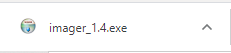
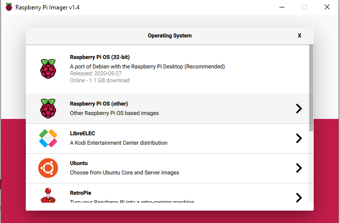

## Instalar o Raspberry Pi OS no seu cartão SD com o Raspberry Pi Imager

Muitos fornecedores vendem cartões SD com um instalador simples do Raspberry Pi OS pré-instalado chamado NOOBS, mas você mesmo pode instalar o Raspberry Pi OS usando um computador que tenha um slot para cartão SD ou usando um leitor de cartões SD.

Usar o Raspberry Pi Imager é o jeito mais fácil de instalar o Raspberry Pi OS no seu cartão SD.

**Nota:** Usuários avançados que queiram instalar um sistema operational específico devem usar este guia para [instalar imagens de sistemas operacionais](https://www.raspberrypi.org/documentation/installation/installing-images/README.md).

### Baixar e executar o Raspberry Pi Imager

+ Visite [www.raspberrypi.org/downloads/](https://www.raspberrypi.org/downloads/).
+ Clique no link para o Raspberry Pi Imager que corresponda ao seu sistema operacional.

+ Quando o download terminar, clique no arquivo para executar o instalador.

### Usando o Raspberry Pi Imager

Todos os dados previamente armazenados no cartão SD serão excluídos e sobrescritos durante a formatação, então se certifique de que você fez um backup dos dados do cartão SD, ou de quaisquer arquivos que você queira guardar, antes de executar o instalador.

Quando você executar o instalador, o seu sistema operacional pode impedir que você o execute. Por exemplo, o Windows pode mostrar a seguinte mensagem:

+ Se você receber esta mensagem, clique em `Mais informações` e depois em `Executar assim mesmo`.

+ Insira o seu cartão SD no slot de cartão SD do computador ou laptop.

+ No Raspberry Pi Imager, selecione o sistema operacional que você quer instalar. A primeira opção, Raspberry Pi OS, é o sistema operacional recomendado.

+ Selecione o cartão SD no qual você gostaria de colocar o sistema operacional. Plataformas diferentes mostram os drives de formas diferentes. O macOS, por exemplo, mostra todos os drives, inclusive o drive principal do sistema operacional.

**Nota:** Certifique-se de que você está selecionando o drive correto. A capacidade de armazenamento dos drives pode ser útil para identificar qual drive você realmente quer selecionar.

Depois que você selecionar o sistema operacional e o cartão SD, um novo botão `GRAVAR (WRITE)` será exibido.

+ Em seguida, clique no botão `GRAVAR (WRITE)`.

+ Aguarde até que o Raspberry Pi Imager termine a gravação.

+ Depois de ver a seguinte mensagem, você poderá ejetar o seu cartão SD.

